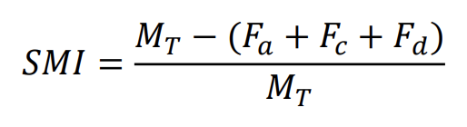

# Avaliação 3 de OTES-12 (Tópicos Avançados de Engenharia de Software)

## Enunciado

## Arquitetura e recursos

A arquitetura de microsserviços RESTful foi utilizada para a gestão dos serviços propostos. Estes serviços estão documentados segundo a [especificação **OpenAPI 3**](https://swagger.io/specification/), e são acessíveis através da [interface gráfica do **Swagger**](https://swagger.io/tools/swagger-ui/).

O serviço principal `mpsbr` , que roda na porta `8000`, depende dos serviços `metricas` e `indicadores`, que rodam nas portas `8001` e `8002`, respectivamente, para determinar a capacidade de processos.

## Tecnologias empregadas

A aplicação de cada tecnologia é detalhada no vídeo enviado no contexto da avaliação.
### [JavaScript](https://developer.mozilla.org/pt-BR/docs/Web/JavaScript)

Linguagem de programação interpretada, utilizada no projeto.

### [Node.js](https://nodejs.org/en/about/)

Ecossistema de servidor que executa JavaScript.

### [Axios](https://github.com/axios/axios)

Biblioteca para requisições HTTP a partir do navegador ou de Node.js.

### [oas3-tools](https://www.npmjs.com/package/oas3-tools)

Biblioteca que fornece suporte a OpenAPI 3 para Node.js.

### [Jest](https://jestjs.io/pt-BR/)

*Framework* para testes em JavaScript.

## Critérios

### Escala utilizada para caracterização dos indicadores

|Grau de implementação|Caracterização|
|-|-|
|4|Excelente|
|3|Bom|
|2|Regular|
|1|Insuficiente|
|0|Ausente|

### Determinação da capacidade

|GPR|REQ|O processo produz resultados definidos|A execução do processo é planejada e monitorada|As pessoas estão preparadas para executar suas responsabilidades no processo|
|-|-|-|-|-|
|Média menor que Regular (<2)|Média menor que Regular (<2)|Não|Não|Não|
|Média menor que Regular (<2)|Média Regular ou melhor (>=2)|Sim|Não|Não|
|Média Regular ou melhor (>=2)|Média menor que Regular (<2)|Não|Sim|Não|
|Média Regular ou melhor (>=2)|Média Regular ou melhor (>=2)|Sim|Sim|Sim|

## Microsserviços

### `/mpsbr-g`

Este microsserviço é executado na porta `8000` e depende do microsserviço `/indicadores` para determinar a capacidade.

### `/indicadores`

Este microsserviço roda na porta `8002` e recebe as entradas referentes aos indicadores de **Gerência de Projetos** e de **Engenharia de Requisitos**, para retornar as médias deles.

### `/metricas`

Este microserviço possui os *endpoints* necessários para calcular as seguintes métricas:

#### Integridade

#### Eficiência na Remoção de Defeitos

#### Exposição ao Risco

#### Índice de Maturidade de Software

Maiores detalhes sobre as fórmulas não fornecidos na especificação da API.
## Requisitos e utilização

Para a utilização dos serviços é necessário que os mesmos sejam executados localmente e, portanto, que a máquina tenha instalado o **Node.js** na versão 14.

Execute os seguintes passos:

1. Abra um terminal em `/mpsbr`.

2. Execute o comando `npm install`.

3. Execute o comando `node index.js`

4. Abra outro terminal em `/metricas`.

5. Execute o comando `npm install`.

6. Execute o comando `node index.js`

7. Abra mais um terminal em `/indicadores`.

8. Execute o comando `npm install`

9. Execute o comando `node index.js`