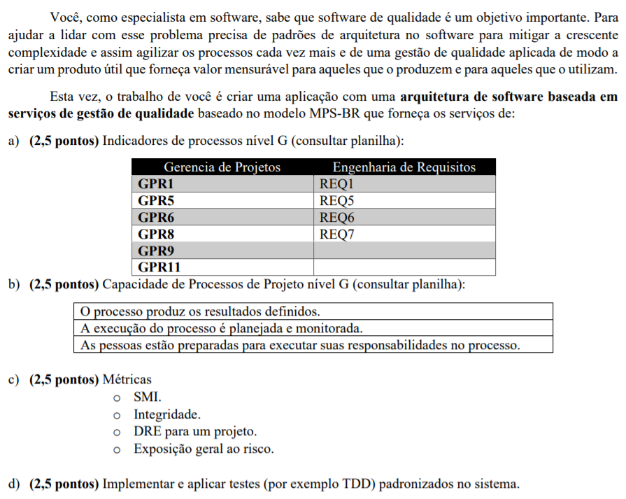

# Avaliação 3 de OTES-12 (Tópicos Avançados de Engenharia de Software)

## Enunciado

## Arquitetura e recursos

A arquitetura de microsserviços foi utilizada para a gestão dos serviços propostos. Estes serviços estão documentados segundo a [especificação **OpenAPI 3**](https://swagger.io/specification/) para **REST**, e são acessíveis através da [interface gráfica do **Swagger**](https://swagger.io/tools/swagger-ui/).

## Tecnologias empregadas

A aplicação de cada tecnologia é detalhada no vídeo enviado no contexto da avaliação.
### [JavaScript](https://developer.mozilla.org/pt-BR/docs/Web/JavaScript)

Linguagem de programação interpretada, utilizada no projeto.

### [Node.js](https://nodejs.org/en/about/)

Ecossistema de servidor que executa JavaScript.

### [Axios](https://github.com/axios/axios)

Biblioteca para requisições HTTP a partir do navegador ou de Node.js.

### [oas3-tools](https://www.npmjs.com/package/oas3-tools)

Biblioteca que fornece suporte a OpenAPI 3 para Node.js.

### [Jest](https://jestjs.io/pt-BR/)

*Framework* para testes em JavaScript.

## Escala utilizada para caracterização do resultado esperado do processo

|Grau de implementação|Caracterização|
|-|-|
|Excelente|O indicador direto está presente, é julgado adequado e não possui pontos fracos|
|Bom|O indicador direto está presente e é julgado adequado, porém possui pontos fracos|
|Regular|O indicador direto está presente mas é julgado inadequado|
|Insuficiente|O indicador direto está parcialmente presente|
|Ausente|O indicador direto não está presente|

## Requisitos e utilização

Para a utilização dos serviços é necessário que os mesmos sejam executados localmente e, portanto, que a máquina tenha instalado o **Node.js** na versão 14.

Execute os seguintes passos:

1. Abra um terminal em `mpsbr`.

2. Execute o comando `npm install`.